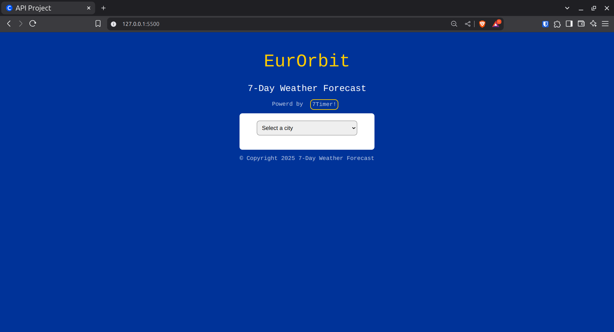
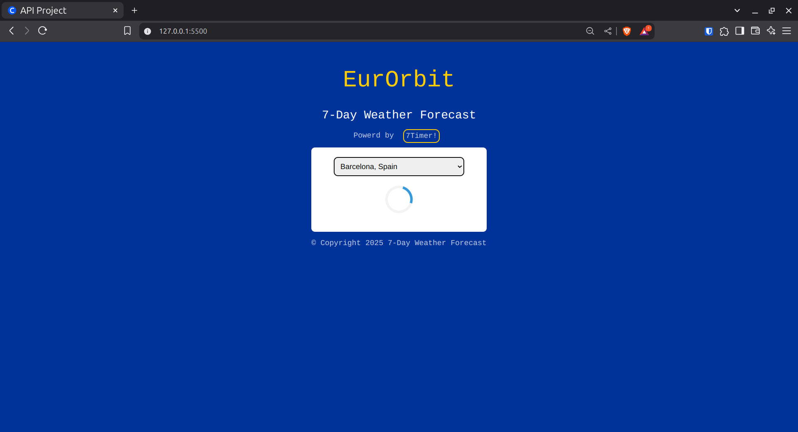
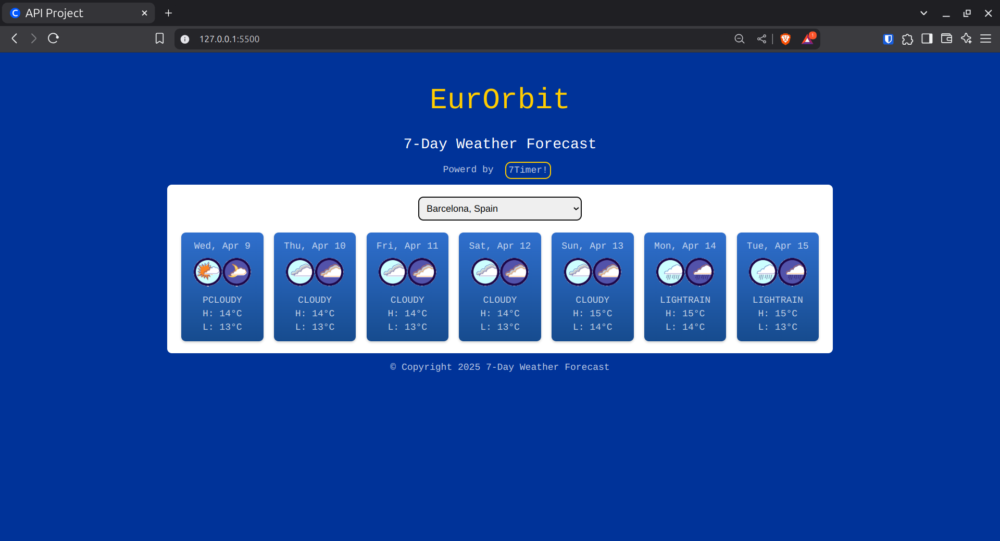
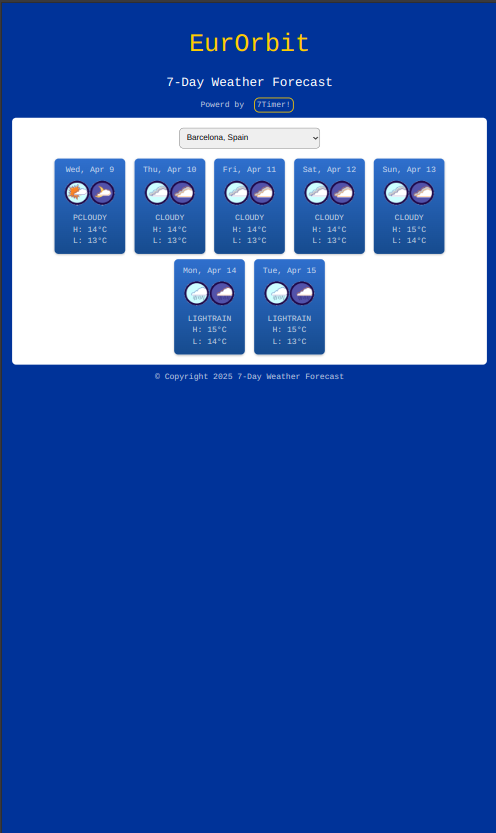

# EurOrbit - 7-Day Weather Forecast

EurOrbit is a simple web-based application that provides a **7-day weather forecast** for cities across Europe using the [7Timer!](http://www.7timer.info/doc.php?lang=en) weather API.

This project showcases how to integrate a CSV-based city coordinate system with an external weather API, and dynamically update the UI with weather forecasts — complete with loading spinners and weather icons.

## Features

- 7-day weather forecast including **temperature highs and lows**
- City selector populated from a local `city_coordinates.csv` file
- Simple, responsive design using HTML, CSS, and JavaScript

## Project Structure

```bash
/
├── index.html              # Main HTML structure
├── css/
│   └── master.css          # Styling and animations
├── js/
│   └── main.js             # Core logic (parsing, fetch, render)
├── images/                 # Directory containing weather condition icons (images)
├── city_coordinates.csv    # CSV file containing cities with latitude, longitude, and country
└── README.md               # This file
```

## How to Run the Project Locally

1. **Clone the repository** or download the project files.

2. **Ensure you have a local web server**, since some browsers block `fetch()` on local files (CSV, JSON, etc.).

   - You can use VS Code's Live Server extension:

   Launch VS Code Quick Open (Ctrl+P), paste the following command, and press enter.

   ```bash
   ext install ritwickdey.LiveServer
   ```

     Then open [http://127.0.0.1:5500/](http://127.0.0.1:5500/) in your browser.

3. **Select a city** from the dropdown menu and view the forecast!

## Data Source

This app uses data from [7Timer! API](http://www.7timer.info/doc.php?lang=en) with the `civillight` product, which provides:

- Weather condition codes
- High and low temperatures
- 7-day outlook

## Screenshot









## License

This project is for educational and demonstration purposes. Attribution to 7Timer! API for the forecast data.

## Acknowledgments

- [7Timer! Weather API](http://www.7timer.info/)
- [Coursera Project: Build a Website using an API with HTML, JavaScript, and JSON](https://www.coursera.org/learn/showcase-build-a-website-api-html-javascript-json/)
